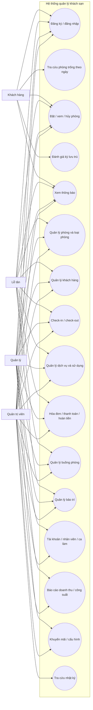

# Sơ đồ Use Case

```mermaid
flowchart LR
  Customer[Khách hàng]
  Receptionist[Lễ tân]
  Manager[Quản lý]
  Admin[Quản trị viên]

  subgraph HotelSystem[Hệ thống quản lý khách sạn]
    UCAuth((Đăng ký / đăng nhập))
    UCRoomSearch((Tra cứu phòng trống theo ngày))
    UCBooking((Đặt / xem / hủy phòng))
    UCReview((Đánh giá kỳ lưu trú))
    UCNotify((Xem thông báo))
    UCRoom((Quản lý phòng và loại phòng))
    UCCustomer((Quản lý khách hàng))
    UCStay((Check-in / check-out))
    UCService((Quản lý dịch vụ và sử dụng))
    UCInvoice((Hóa đơn / thanh toán / hoàn tiền))
    UCHousekeeping((Quản lý buồng phòng))
    UCMaintenance((Quản lý bảo trì))
    UCStaff((Tài khoản / nhân viên / ca làm))
    UCReport((Báo cáo doanh thu / công suất))
    UCSupport((Khuyến mãi / cấu hình))
    UCLog((Tra cứu nhật ký))
  end

  Customer --> UCAuth
  Customer --> UCRoomSearch
  Customer --> UCBooking
  Customer --> UCReview
  Customer --> UCNotify

  Receptionist --> UCAuth
  Receptionist --> UCRoom
  Receptionist --> UCCustomer
  Receptionist --> UCBooking
  Receptionist --> UCStay
  Receptionist --> UCService
  Receptionist --> UCInvoice
  Receptionist --> UCHousekeeping
  Receptionist --> UCMaintenance
  Receptionist --> UCNotify

  Manager --> UCAuth
  Manager --> UCRoom
  Manager --> UCCustomer
  Manager --> UCBooking
  Manager --> UCStay
  Manager --> UCService
  Manager --> UCInvoice
  Manager --> UCHousekeeping
  Manager --> UCMaintenance
  Manager --> UCStaff
  Manager --> UCReport
  Manager --> UCSupport
  Manager --> UCNotify

  Admin --> UCAuth
  Admin --> UCStaff
  Admin --> UCLog
  Admin --> UCRoom
  Admin --> UCCustomer
  Admin --> UCBooking
  Admin --> UCStay
  Admin --> UCService
  Admin --> UCInvoice
  Admin --> UCHousekeeping
  Admin --> UCMaintenance
  Admin --> UCReport
  Admin --> UCSupport
  Admin --> UCNotify
```

Khách hàng chỉ được thao tác trên hồ sơ/đặt phòng/thông báo của chính mình.
Nhật ký chỉ dành cho Admin; báo cáo chỉ dành cho Manager và Admin.
